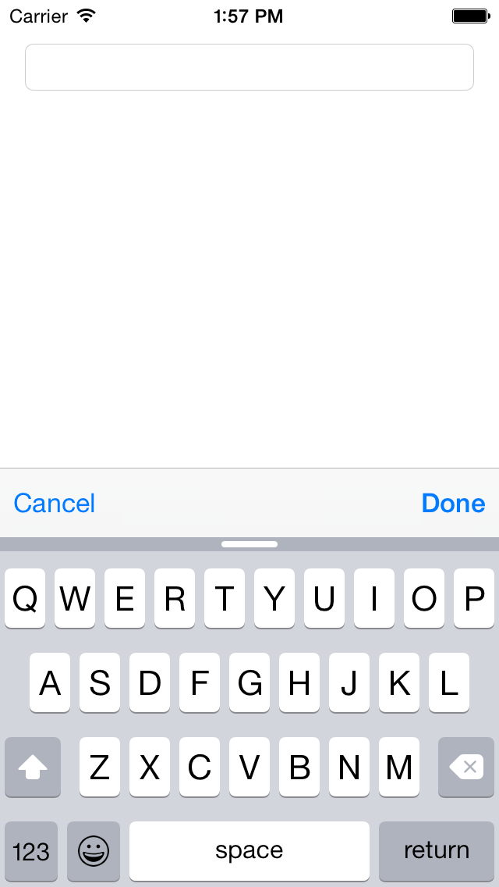

# KeyboardAccessoryToolbar

A simple keyboard accessory toolbar for iOS implemented in Swift.

## Installation

Simply add KeyboardAccessoryToolbar.swift in your project.

## Usage

    extension ViewController: UITextFieldDelegate {
        func textFieldShouldBeginEditing(textField: UITextField) -> Bool {
            // Set to specific text field
            if textField == self.textField {
    
                // Set to text field if not yet added
                if textField.inputAccessoryView == nil {
                    textField.inputAccessoryView = accessoryToolbar
                }
    
                // Set toolbar's current text field to active text field
                accessoryToolbar.currentTextField = textField
            }
    
            return true
        }
    }  

## License

Copyright (c) 2015 Joe Christopher Paul Amanse. This software is licensed under the [MIT License](./LICENSE.md)

